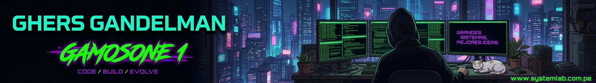

  

 

<table align="center" border="0" cellpadding="0" cellspacing="0" width="100%">
<tr>

<!-- COLUMNA IZQUIERDA -->
<td width="60%" valign="top">

<h1>👋 Hola, soy Ghers</h1>

Bienvenido a mi perfil de GitHub

Soy un desarrollador apasionado por la tecnología, enfocado en crear soluciones reales, aprender siempre y llevar mis ideas al siguiente nivel.

 
 

  

  

</td>

<!-- COLUMNA DERECHA -->
<td width="40%" valign="top">

<h3 style="margin-top: 0; color: #E5E7EB;">Estadísticas de GitHub</h3>

  
<h3 style="color: #E5E7EB;">Lenguajes más utilizados</h3>

   

</td>
</tr>
</table>
