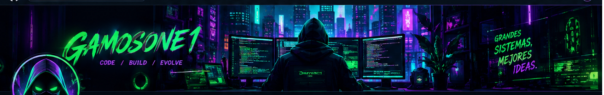
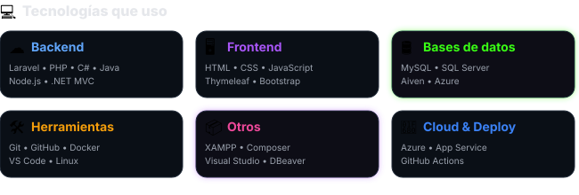
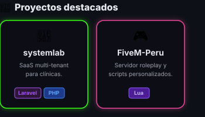
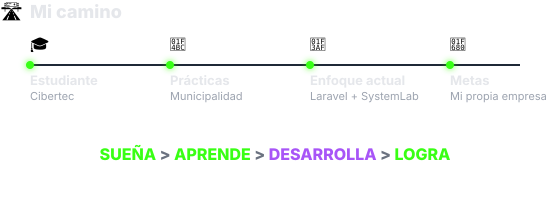
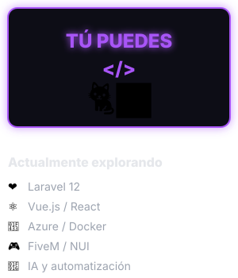

  

 

<!-- INICIO DEL LAYOUT DE DOS COLUMNAS -->
<table width="100%" style="border-collapse: collapse; border: none; background: #0D1117; color: white;">
<tr style="border: none;">

<!-- COLUMNA IZQUIERDA (65%) -->
<td width="65%" valign="top" style="border: none; padding-right: 20px;">

<table>
<tr style="border: none; background: transparent;">
<td width="70%" style="border: none;">
<h1>👋 Hola, soy Ghers</h1>

Bienvenido a mi perfil de GitHub

Soy un desarrollador apasionado por la tecnología, enfocado en crear soluciones reales, aprender siempre y llevar mis ideas al siguiente nivel.

</td>
<td width="30%" align="center" style="border: none;">

</td>
</tr>
</table>

 

  

  

</td>

<!-- COLUMNA DERECHA (35%) -->
<td width="35%" valign="top" style="border: none;">

<h3 style="margin-top: 0; color: #E5E7EB;">Estadísticas de GitHub</h3>

  
<h3 style="color: #E5E7EB;">Lenguajes más utilizados</h3>

   

</td>

</tr>
</table>
